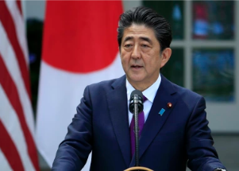

## Ex-Japanese PM Shinzo Abe assassinated during speech

Former Japanese Prime Minister Shinzo Abe died at a hospital after he was shot during a campaign speech in the western city of Nara, officials said. He was 67.

[Warning: Graphic image »](https://www.yahoo.com/news/japan-ex-leader-abe-reportedly-031004756.html)
