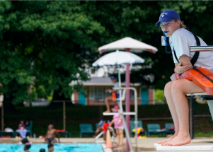

## The issue cropping up at pools across the U.S.

The U.S. is currently facing a "critical" lifeguard shortage — and it's affecting Americans' ability to take a cool dip in a public pool this summer.

[3 drivers of the shortage »](https://www.yahoo.com/finance/news/3-drivers-critical-lifeguard-shortage-200905442.html)
