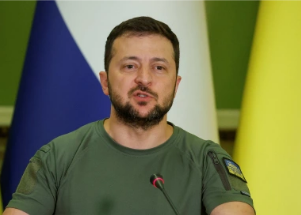

## Ukraine's demands now clash with U.S. concerns

Pulling Ukrainians out of battle to train them on new U.S. weapons could accelerate Russia’s gains, officials say. The Pentagon is also monitoring the levels of its own stockpiles.

[Russian forces intensifying bombardment »](https://www.yahoo.com/news/ukraines-demands-more-weapons-clash-115008191.html)
