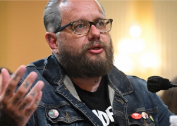

## Former Oath Keeper offers dire warning to the nation

Jason Van Tatenhove, a former spokesperson for the Oath Keepers, told the Jan. 6 panel that the violence at the Capitol could have been far worse and he fears for the next election.

[Why he left the organization »](https://www.yahoo.com/news/january-6-hearing-oath-keepers-fear-next-election-203851656.html)
