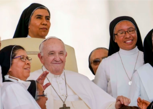

## A historic first for women within the Catholic Church

Pope Francis named three women to serve as members of the Vatican office that vets bishop nominations, in another first for women to have a say in Catholic Church governance.

[A second-class status in the church »](https://www.yahoo.com/news/vatican-names-3-women-office-112238545.html)
