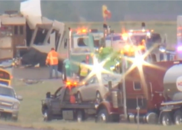

## 6 people die after freak storm causes highway pileup

A "zero visibility" dust storm fueled by 60 mph winds led to a 21-vehicle pileup on Interstate 90 east of Billings, Mont., that snarled traffic and left six people dead.

['Kind of appeared out of nowhere' »](https://www.yahoo.com/news/mass-casualty-vehicle-pileup-montana-014626740.html)
