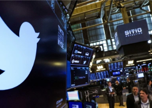

## Twitter: 'We're in a bad place,' legendary investor

Roger McNamee, the venture capitalist and early Facebook investor, called Twitter one of the “biggest missed opportunities in the history of Silicon Valley,” in a Yahoo Finance interview.

['Almost entirely negative' »](https://www.yahoo.com/finance/news/roger-mcnamee-twitter-missed-opportunity-145814888.html)
