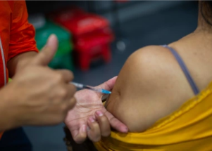

## Vaccine study confirms reports about menstruation

A new study — the largest to date — expands on research that has highlighted the temporary effects of COVID-19 vaccines on menstrual cycles.

[Why do these changes occur? »](https://www.yahoo.com/news/largest-study-date-shows-covid-144335058.html)
