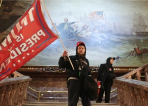

## Harvard study makes clear what motivated Jan. 6 rioters

A Harvard study that examined the rioters' motives found the most common responses focused on former President Donald Trump and his lies about the election.

['A desire to support Trump' »](https://www.yahoo.com/news/harvard-study-jan-6-rioters-202704123.html)
