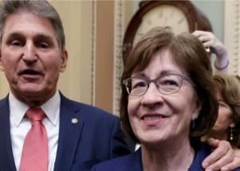

## Senators reach deal on 1887 law at center of Jan. 6 plot

A bipartisan group of senators agreed to overhaul the Electoral Count Act of 1887, the law at the center of then-President Donald Trump's efforts to overturn the 2020 election.

[How it addresses false slates of electors »](https://www.yahoo.com/gma/bipartisan-senators-reach-deal-electoral-171306172.html)
