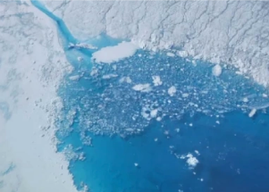

## Massive Greenland ice melt: 18 billion tons in 3 days

The weekend melt, which was two times larger than normal, is part of the 100 billion tons of Greenland water expected to go into the ocean over the summer, researchers say.

[Enough to cover West Virginia »](https://www.yahoo.com/news/greenland-hit-unusually-extensive-melting-110053363.html)
