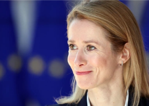

## Estonia's prime minister has stark message for the West

Estonian Prime Minister Kaja Kallas was intent on sending a message to the rest of the world about yielding to Vladimir Putin's demands on Ukraine, in an interview with Yahoo News.

['Don't forget he is a war criminal' »](https://www.yahoo.com/news/estonias-prime-minister-has-a-message-for-the-west-dont-worry-about-putins-feelings-223606146.html)
