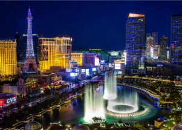

## Las Vegas reports less than 50 days left of clean water

The Las Vegas mayor declared an emergency over the city's water supply after the Calf Canyon-Hermits Peak Fire, the largest wildfire in New Mexico history, fouled a major river.

[Relying on reservoirs for backup »](https://www.yahoo.com/gma/las-vegas-declares-emergency-less-163500105.html)
