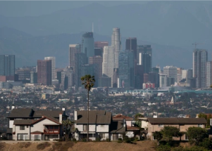

## 'Why are we here?': Fed up and leaving California

Changes in work-life balance, remote work and more people quitting their jobs are some of the factors driving greater numbers of residents out of the Golden State, a new report shows.

[2nd in U.S. for outbound moves »](https://www.yahoo.com/lifestyle/california-exodus-continues-l-san-130027864.html)
