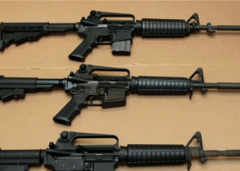

## Assault weapons ban vote: 7 reps break with their party

The House on Friday narrowly passed a bill that would ban assault weapons, with two Republicans and five Democrats bucking their parties on the vote.

[Some explain their position »](https://www.yahoo.com/news/7-congress-members-broke-party-144422436.html)
