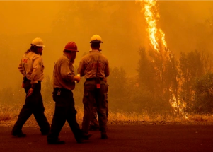

## California wildfire becomes state's largest — by far

The 51,468-acre McKinney Fire near the Oregon border surpassed the Oak Fire in Mariposa County, and forecasters say dry lightning could further expand the flames.

[Gov. Newsom proclaims state of emergency »](https://www.yahoo.com/news/california-fire-becomes-states-largest-023247629.html)
