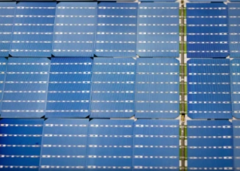

## For U.S. solar industry, Manchin's shift is huge

The solar industry has long faced competitive challenges. But the outlook brightened dramatically with the revival of the climate bill, after a turnabout by Sen. Joe Manchin.

[This era's key industrial policy bill »](https://www.yahoo.com/news/joe-manchins-change-heart-could-131445962.html)
