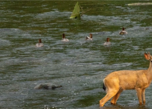

## 'If it was in that river, it died,' California fisherman laments

Northern California's McKinney Fire has led to a mass fish kill in the Klamath River, which runs for more than 250 miles.

['I'm about ready to cry' »](https://www.yahoo.com/news/california-fire-floods-turn-river-181434481.html)
