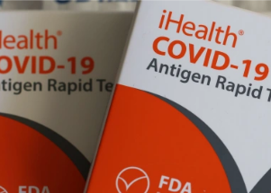

## FDA warns about at-home rapid antigen tests for COVID

The FDA said that at-home rapid antigen tests can deliver false negative results and people who need tests should should plan to do so more than once.

[How long to wait to test after exposure »](https://www.yahoo.com/news/the-fda-recommends-repeated-at-home-tests-to-avoid-false-negatives-170635218.html)
