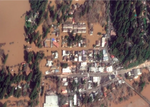

## A warning of disaster 'larger than any in world history'

As the Earth warms, a "megaflood" in California that would swamp parts of Los Angeles, displace millions and cause historic damage gets more likely, according to a new study.

[Sounding the alarm »](https://www.yahoo.com/news/disaster-larger-world-history-coming-204541985.html)
