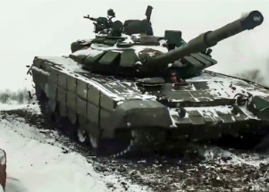

## Russian troops could soon be haunted by 'rasputitsa'

As summer turns to fall in Ukraine, Russian forces might have to confront the muddy conditions that bogged down Napoleon in 1812 and Hitler's invasion in World War II.

[Assessment of military experts »](https://www.yahoo.com/news/the-return-of-rasputitsa-and-what-it-means-for-russias-war-in-ukraine-183138153.html)
