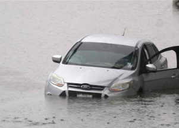

## 2 words Texas gov. won't say despite '1,000-year storm'

A day after a historic storm dumped up to 15 inches of rain in Dallas, triggering catastrophic flash floods, Texas Gov. Greg Abbott avoided using the term "climate change."

['Extreme weather' »](https://www.yahoo.com/news/texas-gov-abbott-wont-say-climate-change-extreme-weather-dallas-floods-191254447.html)
