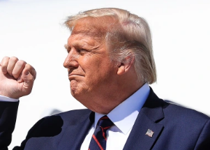

## DOJ releases memo detailing decision not to charge Trump

The Justice Department released a 2019 memo used by former AG William Barr to justify his decision not to prosecute Donald Trump for his actions during the Russia investigation.

[Mueller's 'novel' obstruction theory »](https://www.yahoo.com/gma/doj-releases-memo-behind-barrs-200500468.html)
