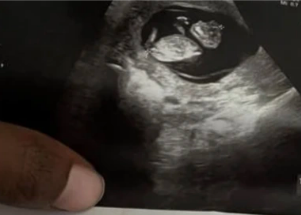

## Woman whose fetus has no skull denied abortion

At 10 weeks, doctors told Nancy Davis that her fetus had no skull and would likely be stillborn but that performing an abortion would violate Louisiana's stringent ban.

['They seemed confused about the law' »](https://www.yahoo.com/news/la-woman-denied-an-abortion-for-fetus-without-skull-says-shell-seek-the-procedure-out-of-state-201409661.html)
