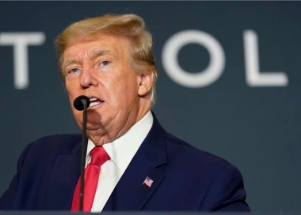

## Judge hands Trump a win in Mar-a-Lago documents case

A federal judge in Florida said it was her "preliminary intent" to grant a request from Donald Trump’s lawyers to have a special master review records taken from Mar-a-Lago.

[Possible effect on DOJ investigation »](https://www.yahoo.com/news/judge-plans-appoint-special-master-221833479.html)
