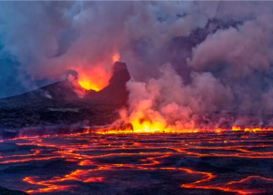

## Volcano erupted without warning. Scientists find clues.

Last year, one of the most dangerous volcanoes in Africa erupted without warning. Yet, in a way, Nyiragongo, a vertiginous volcano in Congo, is always erupting.

['Good reminder not to get cocky' »](https://www.yahoo.com/news/volcano-erupted-without-warning-now-141907588.html)
