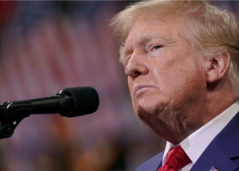

## Election rule raises dilemma for DOJ on Trump inquiries

Attorney General Merrick Garland's team could scale back work in investigations involving former President Donald Trump because of a rule dealing with the election calendar.

[Why a subpoena could be forthcoming »](https://www.yahoo.com/news/midterms-near-election-rule-raises-113702756.html)
