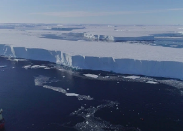

## Scientists issue stark warning on 'doomsday glacier'

A glacier in Antarctica the size of Florida that could dramatically raise global sea levels is disintegrating faster than previously predicted, according to a new study.

['Expect to see big changes' »](https://www.yahoo.com/news/doomsday-glacier-is-melting-faster-than-thought-study-finds-223130542.html)
