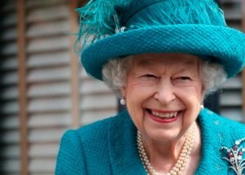

## 'Her loss will be deeply felt': Queen Elizabeth dies at 96

Queen Elizabeth II died peacefully at Balmoral Castle in Scotland on Thursday surrounded by members of her immediate family, including her son and heir, Charles.

[Fulfilled her final official engagement »](https://www.yahoo.com/news/queen-elizabeth-dies-96-buckingham-palace-173246365.html)
