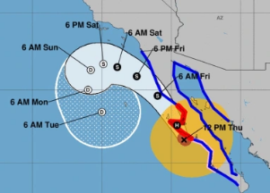

## Parts of Calif. could see 1 year's worth of rain

After days of record-breaking heat, Southern California is bracing for potential impacts from Hurricane Kay, which could bring a year's worth of rain in 36 hours to some areas.

[Landfall in Mexico »](https://www.yahoo.com/news/hurricane-kay-adds-to-most-unusual-and-extreme-weather-week-for-california-183553133.html)
