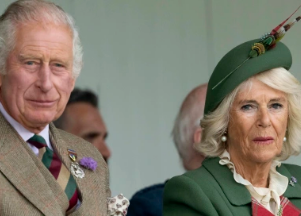

## What is Camilla's title now that Charles is king?

While the wife of a king is traditionally crowned queen, the question of what title Camilla would hold when Charles became king had been a tricky one for many years.

[Title comes with Queen Elizabeth's blessing »](https://www.yahoo.com/news/camilla-becomes-queen-without-sovereign-182743794.html)
