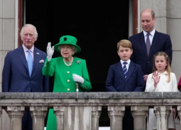

## Charles inherits untold riches and passes off own empire

As prince, Charles used tax breaks, offshore accounts and canny real estate investments to turn a sleepy estate into a billion-dollar business.

[Royal family’s fortune estimated to be $28B »](https://www.yahoo.com/news/king-charles-inherits-untold-riches-115328589.html)
