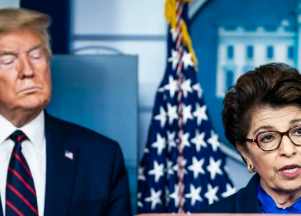

## U.S. erroneously awarded $1.3B to foreign applicants

A new report from the Small Business Administration inspector general raises concern that the money might have benefited overseas crime syndicates.

[Highly suggestive of fraud »](https://www.yahoo.com/news/u-sent-1-3-billion-015248854.html)
