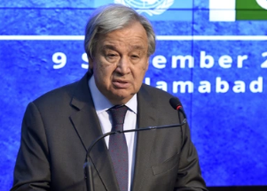

## U.N. chief warns of chaos on 'unimaginable scale'

At the U.N. General Assembly, Secretary-General António Guterres delivered a stark message demanding more aggressive action to mitigate climate change.

[Vulnerable people 'paying a horrific price' »](https://www.yahoo.com/news/betrayal-and-injustice-un-secretary-general-says-global-climate-change-response-is-falling-short-170409764.html)
