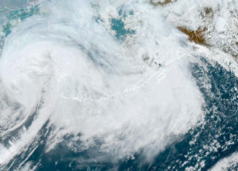

## State braces for monster storm and major floods

Nearly 50-foot waves and tides up to 13 feet are expected as a dangerous storm tied to Typhoon Merbok brings hundreds of miles of hurricane-force winds to Alaska.

['Potentially historical' »](https://www.yahoo.com/news/alaska-storm-could-bring-worst-140424218.html)
