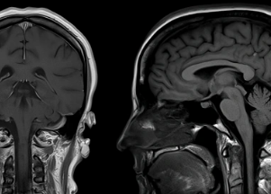

## COVID brain finding could affect millions in U.S.

People who had COVID-19 are at higher risk for a host of brain injuries a year later compared with people who were never infected by the coronavirus.

[The most common symptom »](https://www.yahoo.com/news/covid-raises-risk-long-term-150329709.html)
