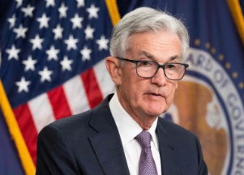

## Buckle up: Fed chair issues warning after latest move

Markets have given up on a soft landing, in which the Fed gets inflation under control without causing collateral damage to the economy.

[Rick Newman's column »](https://www.yahoo.com/finance/news/this-week-in-bidenomics-buckle-up-for-a-hard-landing-201304138.html)
