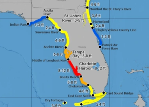

## Hurricane Ian: A dangerous situation

Though Ian could weaken slightly Wednesday before making landfall, the potential 12-foot storm surge it generates will remain a serious threat due to rising sea levels, forecasters said.

[Florida's west coast braces for the worst  »](https://www.yahoo.com/news/hurricane-ian-packs-catastrophic-storm-surge-threat-made-worse-by-climate-change-180421826.html)
