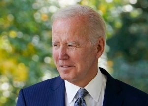

## Fee change will save millions in U.S. hundreds of dollars

The rare 3% decrease in monthly premiums is likely to be coupled with a historically high cost-of-living increase in Social Security, saving millions of people hundreds of dollars.

['Something we may never see again' »](https://www.yahoo.com/finance/news/millions-americans-save-medicare-fees-183012571.html)
