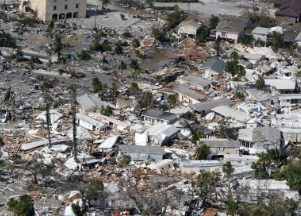

## 'Homeowners will be forced into delinquency' after Ian

Hurricane Ian could be the costliest Florida storm since Hurricane Andrew battered the state in 1992, with a record amount of homes and properties lost, a data company said.

[A difficult road ahead »](https://www.yahoo.com/finance/news/insurers-brace-hit-floridas-costliest-120339135.html)
