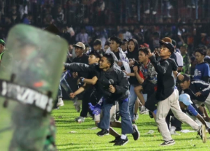

## 174 people killed in chaos at Indonesian soccer match

Authorities said most of the victims were trampled to death after police fired tear gas to dispel riots Saturday, making it one of the deadliest sports events in the world.

[More than 100 injured »](https://www.yahoo.com/news/127-soccer-fans-police-killed-002644084.html)
