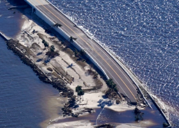

## They wanted homes near the coast. Now it's costing them.

Hurricane Ian underscores the vulnerability of the nation's barrier islands and the increasing costs for people living on the thin strips of land parallel to the coast.

['Just waiting for a storm to take them away' »](https://www.yahoo.com/news/ian-shows-risks-costs-living-140233399.html)
