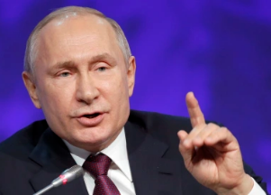

## Putin is now realizing what U.S. concluded years ago

Russian President Vladimir Putin has 2,000 small nuclear weapons, but their utility on the battlefield may not be worth the longer-term costs.

[Hard to use, harder to control  »](https://www.yahoo.com/news/russias-small-nuclear-arms-risky-115633238.html)
