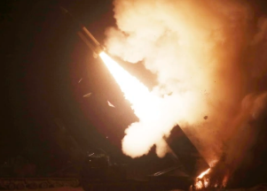

## S. Korea missile crash during drill with U.S. panics city

A South Korean ballistic missile blew up Wednesday during a live-fire drill with the U.S. that was a reprisal for North Korea firing a missile over Japan a day earlier.

[Explosion and fire panic local residents »](https://www.yahoo.com/news/skorea-says-missile-malfunctioned-fell-230503953.html)
