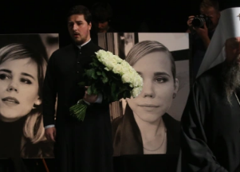

## Dugina assassination could test U.S.-Ukraine relations

U.S. intel agencies believe some in the Ukrainian government authorized the car bomb near Moscow in August that killed Darya Dugina, daughter of a prominent Russian nationalist.

[Zelensky adviser reiterates denial  »](https://www.yahoo.com/news/u-believes-ukrainians-were-behind-184556126.html)
